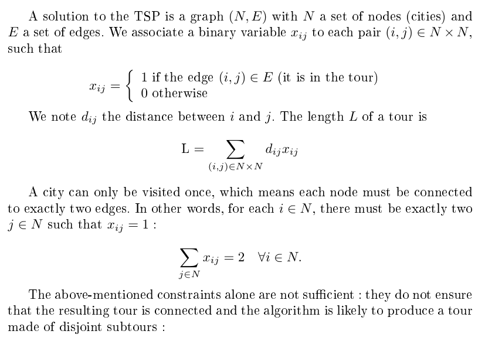
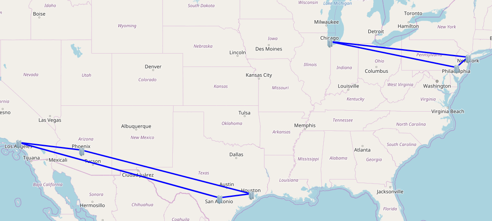

# Introduction

The travelling salesman problem (TSP) asks the following question: "Given a list of cities and the distances between each pair of cities, what is the shortest possible route that visits each city and returns to the origin city ?

pyTSP uses various approaches to solve the TSP (linear programming, construction heuristics, optimization heuristics, genetic algorithm).
It provides a geographical step-by-step visualization of each of these algorithms.


**You can find a demo of pyTSP on a small graph made of all U.S cities with a population larger than 800 000 inhabitants. _[here](http://google.com/)_ !**

# Algorithms

The following algorithms are implemented in pyTSP:

- Construction heuristics
  - Nearest neighbor
  - Nearest insertion
  - Farthest insertion
  - Cheapest insertion
- Optimization heuristics
  - Pairwise exchange (2-opt)
  - Node insertion
  - Edge insertion
- Linear programming
- Genetic algorithm

# Construction heuristics

## Nearest neighbor


```
- Start from a random city.
- Travel to the nearest unvisited city.
- Repeat until every city has been visited.
```

## Nearest insertion

```
- Start from a random city.
- Find the city closest to the (partial) tour, i.e the city i which minimizes d(i, j) 
with j a city already in the tour.
- Insert i before or after j, depending on which option is shorter.
- Repeat until every city has been visited.
```

## Cheapest insertion

```
- Start from a random city.
- Find the city which insertion in the tour causes the smallest increase in length,  
i.e the city k which minimizes d(i, k)  + d(k, j) - d(i, j) with (i, j) an edge in the (partial) tour.
- Insert k between i and j.
- Repeat until every city has been visited.
```

## Farthest insertion

```
- Start from a random city.
- Find the city which insertion in the tour causes the largest increase in length,  
i.e the city k which maximizes d(i, k)  + d(k, j) - d(i, j) with (i, j) an edge in the (partial) tour.
- Insert k between i and j.
- Repeat until every city has been visited.
```

# Optimization heuristics

## Pairwise exchange (2-opt)


```
- Given a pair of edges, there is only one way of deleting and reconnecting the edges to obtain
a valid tour. If this new tour is shorter, make the change.
- Repeat for any pair of edges until no further improvement can be made.
```

## Node insertion


```
- Given a node, remove it from the tour and insert it at the best possible position.
- Repeat for any node until no further improvement can be made.
```

## Edge insertion


```
- Given an edge, remove it from the tour and insert it at the best possible position.
- Repeat for any edge until no further improvement can be made.
```

# Linear programming





# Genetic algorithm

# Getting started

The following modules are used in pyTSP:
```
flask
flask_wtf
flask_socketio (sockets)
flask_sqlalchemy (database)
numpy (linear programming)
cvxopt (linear programming)
xlrd (graph import)
```

In order to use pyTSP, you need to:
    
- (optional) set up a [virtual environment](https://docs.python.org/3/library/venv.html) .

- clone pyTSP (or download as a zip archive from github)
```
git clone https://github.com/afourmy/pyTSP.git
```
    
- install the requirements
```
cd pyTSP
pip install -r requirements.txt
```

- run **/flask_app.py**.
```
python flask_app.py
```

- go the http://127.0.0.1:5000/.

# Contact

You can contact me at my personal email address:
```
''.join(map(chr, (97, 110, 116, 111, 105, 110, 101, 46, 102, 111, 
117, 114, 109, 121, 64, 103, 109, 97, 105, 108, 46, 99, 111, 109)))
```

or on the [Network to Code slack](http://networktocode.herokuapp.com "Network to Code slack"). (@minto, channel #enms)

# Credits 

[Bootstrap](https://getbootstrap.com/ "Bootstrap"): Front-end HTML/CSS framework.

[Flask](http://flask.pocoo.org/ "Flask"): A microframework based on the Werkzeug toolkit and Jinja2 template engine.

[Flask SQLAlchemy](http://flask-sqlalchemy.pocoo.org/ "Flask SQLAlchemy"): Adds support for SQLAlchemy to Flask.

[Jquery](https://jquery.com/ "Jquery"): JavaScript library designed to simplify the client-side scripting of HTML.

[Leaflet](http://leafletjs.com/ "Leaflet"): JavaScript library for mobile-friendly interactive maps.